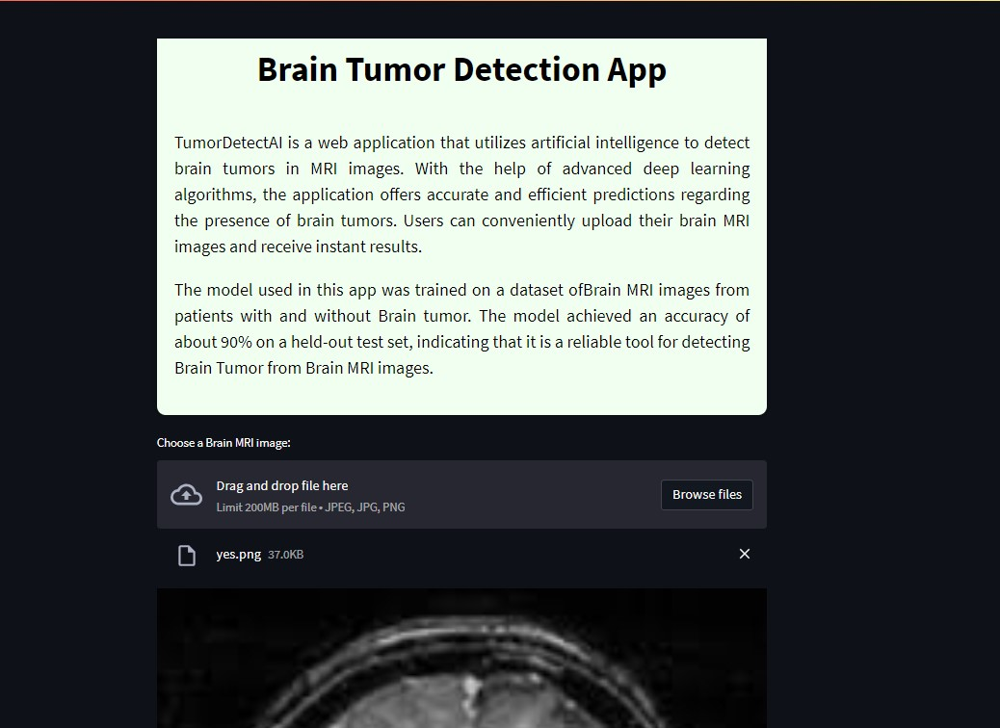

# TumorDetectAI
## Brain Tumor Detection App




TumorDetectAI is a web application that utilizes artificial intelligence to detect brain tumors in MRI images. With the help of advanced deep learning algorithms, the application offers accurate and efficient predictions regarding the presence of brain tumors. Users can conveniently upload their brain MRI images and receive instant results.


[link](https://www.kaggle.com/code/mahtabranjbar/braintumordetection/notebook) to project notebook in kaggle

---- 
## Table of Contents

- [Installation](#installation)
- [Usage](#usage)
- [Dataset](#dataset)
- [Model](#model)
- [Evaluation Metrics](#evaluation-metrics)
- [Contributing](#contributing)
- [License](#license)
- [Contact](#contact)

## Installation

1. Clone this repository to your local machine:

   ```sh
   git clone https://github.com/MahtabRanjbar/TumorDetectAI.git
   ```

2. Navigate to the project directory:

   ```sh
   cd Brain-tumor-detection-app

   ```

3. Install the required packages:

    ```sh
    pip install -r requirements.txt
    ```

## Usage
1. download pretrained model from [here](https://drive.google.com/drive/folders/1-BRhTeD6o9X4ESZVt4iOavjsfFnOoT_M?usp=sharing) and put in `saved_models` folder
2. Start the app by running the following command in your terminal:
    ```sh
    streamlit run src/app.py
    ```

3. Open your web browser and navigate to `http://localhost:8501`. This should open the app in your browser.

4. Upload a Brain MRI image to the app and click the "Predict" button to see the model's prediction. you can use my [sample_images](/sample_data/)

5. If you want to retrain the model, you can execute the following command:
    ```sh
    python src/main.py
    ```
    consider to first download the data and put in data folder as it is said [here](data/README.md)
6. for ease of use and not installing all neccessary packages and having no conflict, you can run the  [notebook](notebooks/braintumordetection.ipynb) of project

## Dataset
The Brain Tumor Detection dataset from [Kaggle](https://www.kaggle.com/datasets/navoneel/brain-mri-images-for-brain-tumor-detection) consists of brain MRI images collected for the purpose of brain tumor detection. The dataset has been split into three subsets: train set, validation set, and test set. The sizes of each subset are as follows:

- Train set size: 161
- Validation set size: 41
- Test set size: 51

 You can download the dataset from the Kaggle website and extract it to the `data` directory in this project.
 For more information on the dataset and its structure,  see [here](data/README.md)

## Model

The model architecture is based on the Resnet50 model, which is a powerful convolutional neural network architecture known for its efficiency and accuracy. In addition to the Resnet base model, additional convolutional layers and fully connected layers have been added to enhance the model's ability to detect brain tumors.

The model is pretrained and saved for ease of use. You can find the pretrained model in the [here](https://drive.google.com/drive/folders/1-BRhTeD6o9X4ESZVt4iOavjsfFnOoT_M?usp=sharing). Instead of retraining the model, you can directly use this pretrained model for your brain tumor detection tasks.

The model is trained using the Adam optimizer, which is a popular choice for deep learning tasks. Adam adjusts the model's weights during training to minimize the loss function and improve the model's performance.

The loss function used in training is binary cross-entropy. This loss function is suitable for binary classification tasks and helps the model learn to distinguish between brain MRI images with tumors and those without.

## Evaluation Metrics
After training and testing the brain tumor detection model, several evaluation metrics have been computed to assess its performance. These evaluation metrics provide insights into the model's effectiveness in detecting brain tumors. The metrics include accuracy, F1 score, recall, and precision.


| Metric     | Value     |
|------------|-----------|
| Accuracy   | 0.9019    |
| F1 Score   | 0.9002    |
| Recall     | 0.9019    |
| Precision  | 0.9054    |

For further evaluation metrics and details, please check the [reports](reports/README.md)  folder.

## Contributing
Contributions are always welcome! If you have any ideas or suggestions, please feel free to open an issue or a pull request.

## License
This project is licensed under the MIT License. See the [LICENSE](LICENSE) file for more information


## Contact
If you have any questions or comments about this project, please feel free to contact me at mahtabranjbar93@gmail.com


